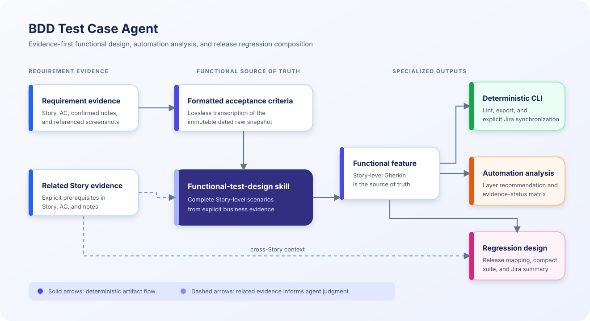

# Architecture

## Design goals

The architecture optimizes for traceability, bounded agent judgment, deterministic verification, and safe external effects. It deliberately avoids requiring an application server or vector database for repository-scale work.

Solid arrows show deterministic artifact flow. Dashed arrows show related requirement evidence that informs agent judgment.

## Responsibility boundaries

| Component | Owns | Does not own |
|---|---|---|
| Functional design skill | AC coverage, scenario boundaries, observable outcomes | Automation placement, release-suite selection |
| Automation analysis skill | Test boundary, dependency strategy, evidence status | Inventing functional behavior, claiming uninspected coverage |
| Regression skill | Full source mapping, risk-based journey composition | Replacing Story functional tests |
| CLI | Command dispatch; fetch, lint, export, validation, and explicit Jira/Zephyr synchronization | Semantic business decisions |

Implementation detail: the CLI delegates authentication and Jira/Zephyr HTTP protocol work to `src/services/`; `src/domain/gherkin-testcases.js` is a pure helper that turns approved Gherkin into a manual-test description. These are implementation boundaries, not separate user-facing architecture components.

## Reliability model

Reliability comes from combining three kinds of controls:

1. Deterministic checks verify syntax, identifiers, exports, and mirror consistency.
2. Agent judgment handles requirement semantics, scenario quality, risk, and architecture-aware recommendations.
3. Human review resolves ambiguous product rules and authorizes remote mutations.

These controls produce different evidence. A passing linter must not be reported as business correctness, and an agent recommendation must not be reported as implemented coverage.

## Cross-Story context

The dated Story snapshots, their Acceptance Criteria, and confirmed notes remain canonical evidence. A related Story may clarify a prerequisite or boundary only when the target requirement provides a meaningful link; inspect and cite the related source rather than treating a generated synthesis as authority. A Wiki can provide optional navigation and synthesis without introducing a second requirement record.

## External-write boundary

Generation, lint, and export checks are local operations. Jira user-story upload and test-ticket synchronization are explicit remote-write commands. Bypassing a quality gate with `--force` does not authorize a remote write.
